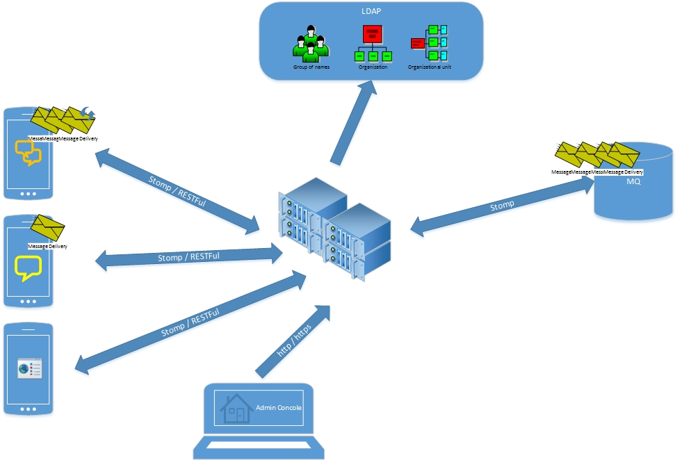
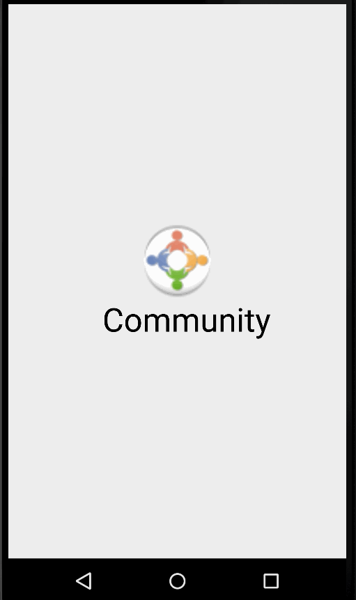
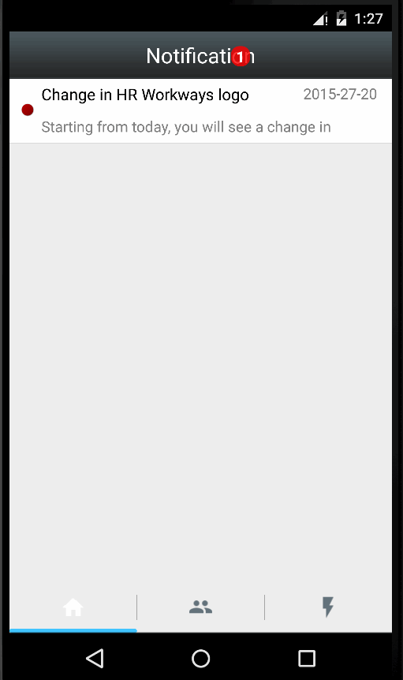

#Community
Community is a social application allows users to subscribe interesting topics and communicate with each other in the group.

Its purpose is to connect the peoples in the specific unit(s) and let the peoples aware of the latest notification(s) no matter if s/he is online.

##High level architecture

##Functionality
###Login
The LADP is used for authenticate the user. Once user has been authenticated and logged in to the application, the re-login is not necessary unless manually logout.
  

###Notification
User receives the notification any time, which means even s/he is offline, the messages will be delivered once s/he is online.

##Acknowledgement
* [butterknife](http://jakewharton.github.io/butterknife/) 
* [sweetalert](http://t4t5.github.io/sweetalert/)
* [slidableactivity](https://github.com/r0adkll/Slidr)
* [smarttablayout](https://github.com/ogaclejapan/SmartTabLayout)
* [recyclerview-animators](https://github.com/wasabeef/recyclerview-animators)
* [swipelayout](https://github.com/daimajia/AndroidSwipeLayout)

##TODO
<table>
    <tr>
        <th>Title</th>
        <th width="400px">Description</th>
        <th>Owner</th>
        <th>Progress</th>
    </tr>
    <tr>
        <td><strike>Make the swipe delete working</strike></td>
        <td>&nbsp;</td>
        <td>Oliver</td>
        <td>Done</td>
    </tr>
</table>

##License

    Copyright 2015 Community

    Licensed under the Apache License, Version 2.0 (the "License");
    you may not use this file except in compliance with the License.
    You may obtain a copy of the License at

       http://www.apache.org/licenses/LICENSE-2.0

    Unless required by applicable law or agreed to in writing, software
    distributed under the License is distributed on an "AS IS" BASIS,
    WITHOUT WARRANTIES OR CONDITIONS OF ANY KIND, either express or implied.
    See the License for the specific language governing permissions and
    limitations under the License.